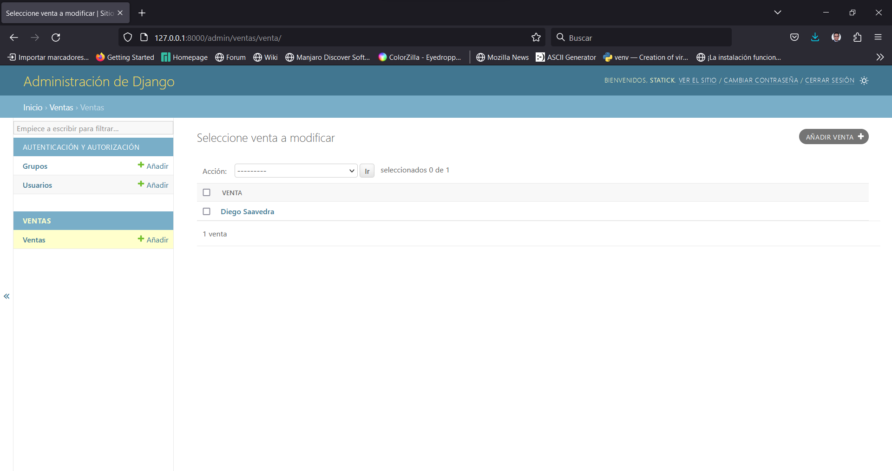
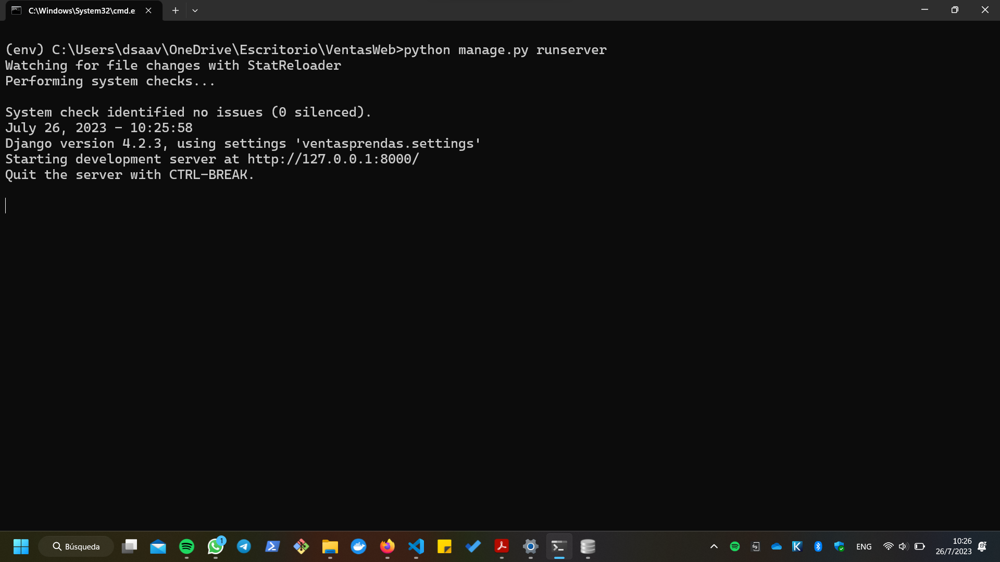

# Sistema de Ventas de Ropa

## Instalar el paquete virtualenv

``` bash
pip install virtualenv
```
## Crear el entorno virtual

``` bash
python -m venv env
```

## Activar el entorno virtual

En Windows
``` bash
cd env/Scripts
activate
```
En Linux o Mac
``` bash
source env/bin/activate
```
## Instalar Django

``` bash
django-admin startproject ventasprendas .
```

## Crear una aplicación

``` bash
python manage.py startapp ventas
```

## Crear las migraciones

``` bash
python manage.py makemigrations
```
``` bash
python manage.py migrate
```
## Crear un super usuario

``` bash
python manage.py createsuperuser
```
## Ejecutar el servidor

``` bash
python manage.py runserver
```
---
## Crear un modelo

``` python
from django.db import models

class Venta(models.Model):

    nombre = models.CharField(max_length=50)
    apellido = models.CharField(max_length=50)
    cédula = models.CharField(max_length=10)
    dirección = models.CharField(max_length=50)
    teléfono = models.CharField(max_length=10)
    correo = models.CharField(max_length=50)
    fecha = models.DateField()
    total = models.DecimalField(max_digits=10, decimal_places=2)
    iva = models.DecimalField(max_digits=10, decimal_places=2)
    subtotal = models.DecimalField(max_digits=10, decimal_places=2)
    descuento = models.DecimalField(max_digits=10, decimal_places=2)

    def __str__(self):
        return self.nombre + ' ' + self.apellido
```

## Registrar el modelo en el administrador

``` python
from django.contrib import admin
from .models import Venta

admin.site.register(Venta)
```
## Aplicar Migraciones

``` bash
python manage.py makemigrations
```
``` bash
python manage.py migrate
```

## Correr el Servidor

``` bash
python manage.py runserver
```


